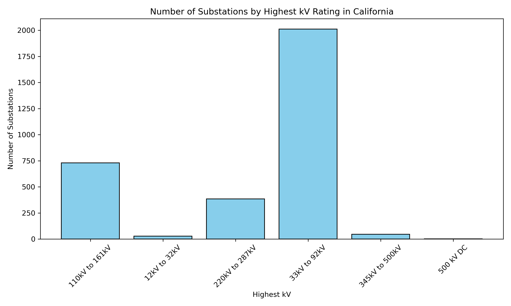
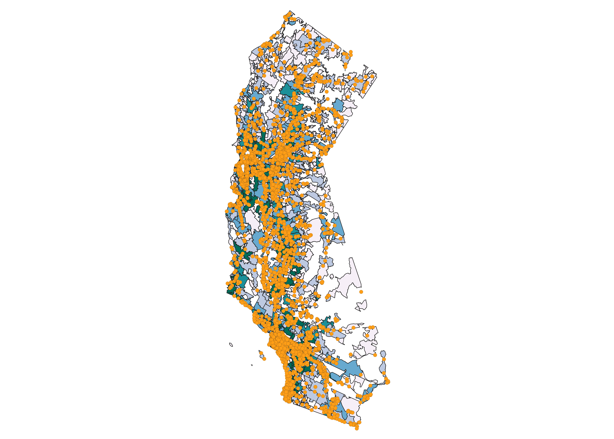

### California Substations Data

#### Data Sources

1. **Electric Substations Data**  
   File: `Operational_Substations_CAL.xlsx`  

2. **Geospatial Data for Substations**  
   Source: [Data Basin – Electric Substations (CA)](https://databasin.org/datasets/cb9ff78949db409f83d4d6ca38f707bf/)  
   Description: Geolocated data of operational substations across California, including attributes such as voltage level and utility provider.

---

#### Code and Visualizations

- **`cal_sub.py`**  
  Description: Aggregates the number of substations by their highest voltage (kV) rating.

  **Number of Substations by Highest kV Rating in California**  
  

---

- **`cal_energy_per_pop.py`**  
  Description: Calculates and visualizes the estimated population served per substation by ZIP code.

  **Estimated People per Substation by ZIP Code**  
  Visualized from `cal_substation_output.gpkg` using QGIS. ZIP codes are color-coded by equal quantiles of estimated population.
    
  
