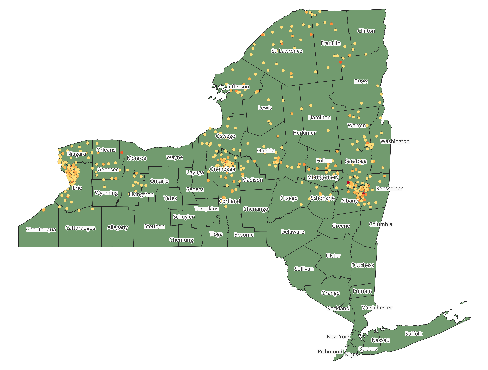

### Data
1.	The "Substations" (Substations.csv) and "National Grid Feeders By Phase" csv files from the National Grid website: https://systemdataportal.nationalgrid.com/NY/ 
2.	The pdf file "List of Electric Substations feeding Distribution System" from the official New York State website (date: 2013) https://documents.dps.ny.gov/public/Common/ViewDoc.aspx?DocRefId=%7B3F86059C-C872-415C-BA34-BCF6D20A831F%7D 
3.	Census Data: zip codes, population, city boundaries for Buffalo and Syracuse

## Working with the substation file obtained from National Grid website
a.	Data Cleaning
1.	```sub_coord.py```:  Substations.csv — cleaning the data and saving as coordinates.csv
2.	```column_names.py```: unifying column names and saving as column_names.csv
3.	```summary_sub_NYS.py```: saving the underground (UG) and overhead (OH) feeders data files with the standardized names. The files also provides summary for the feeders (number of feeders per substation, total amps, amp bins).

b.	Preparing geographical information files
1.	```geo_feeders.py```: creating geo files with all substations ("grid_shape.gpkg") and a file with feeders carrying 10+ MW of power ("MW10_shape.gpkg").
2.	```energy_per_pop.py```: creating maps and plots with information about number of people served
3.	```city_maps.py```: creating maps with substations in and within 2 miles around Syracuse and Buffalo sub_syracuse_map.png and sub_buffalo_map.png
4.	```pop_per_sub.py```: computing population per substation and kW pep population in Syracuse and Buffalo

## Working with Census Data
1.	```ny_population.py``` — downloading population data from Census
2.	```cities_pop_download.py``` — downloading the population data for Buffalo and Syracuse ("syr_pop.csv", "buff_pop.csv")

## Working with the substation file obtained from NY state government website
1.	```NYS_sub.py``` converting nys-substations.xlsx to nys_feeders.csv
2.	```merged coord + feeders.py```: merging the data from National Grid website and NY state government website and saving into sub_shape.csv
3.	```sub_shape.py```: Saving as a geopackage with substations as a layer containing coordinates of substations (sub_shape.gpkg)
 
** The New York State Map with Substations
color-coded by number of feeders (created with QGIS) **

