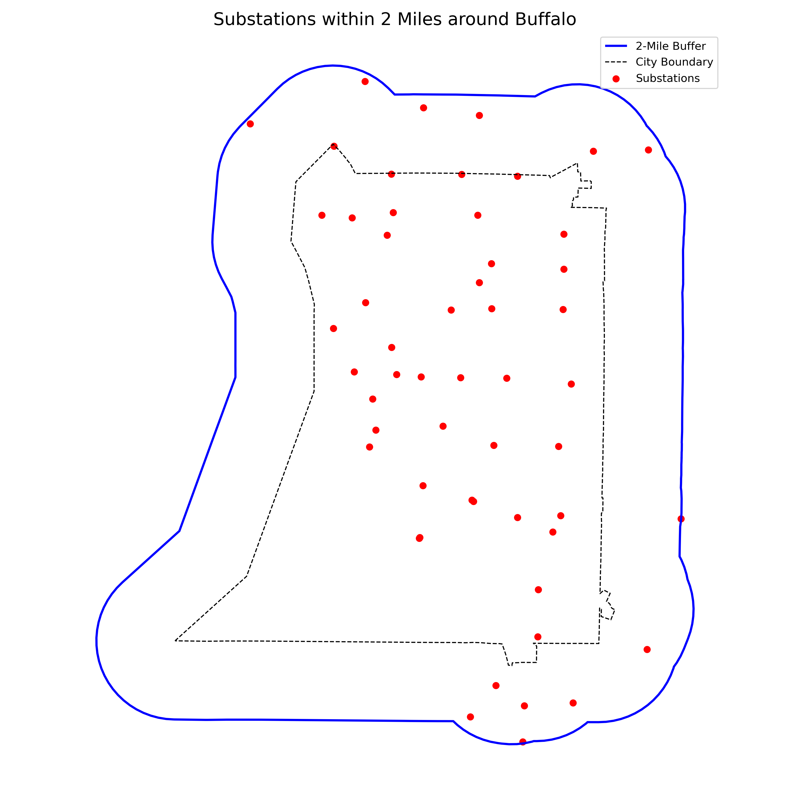
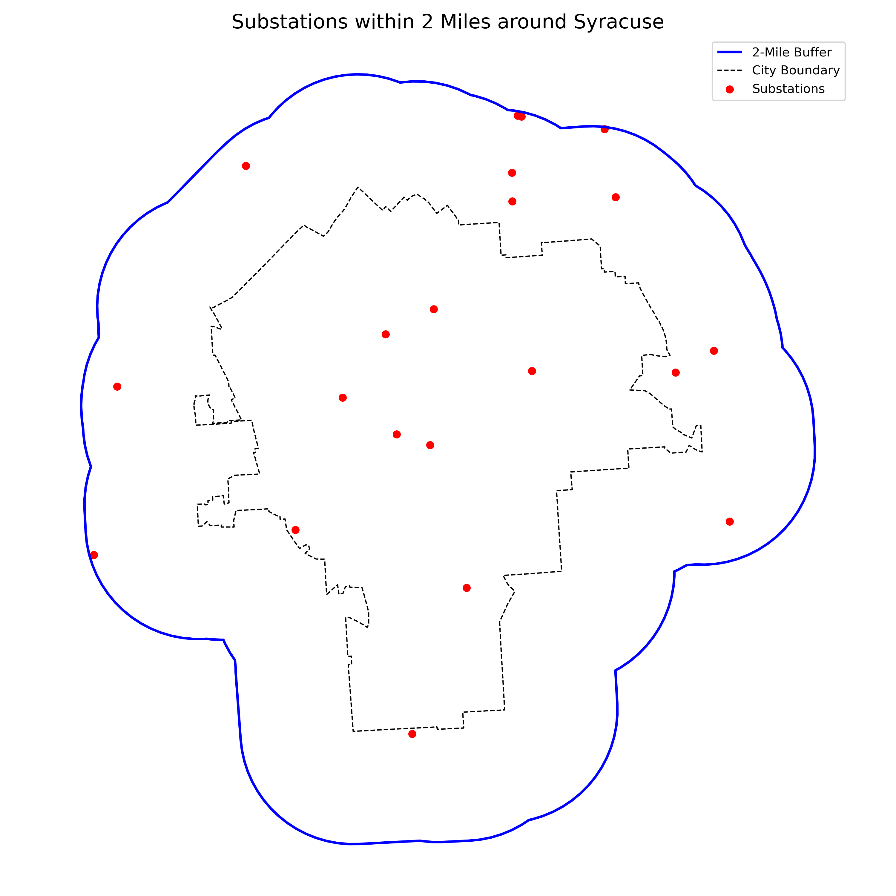

# City-Level Substation Analysis – Buffalo and Syracuse

This folder focuses on mapping and analyzing service coverage in Buffalo and Syracuse.

Scripts depend on outputs from the `nat_grid_maps/` folder.

## Key Functions

- Computing population served by each substation in urban areas
- Visualizing substation proximity and coverage using city boundary shapefiles

## Scripts

1. **`cities_pop_download.py`**  
   - Downloads population data for:
     - Buffalo (`buff_pop.csv`)
     - Syracuse (`syr_pop.csv`

2. **`city_maps.py`**  
   - Visualizes substations in and around Buffalo and Syracuse (within 2-mile radius)
   - Outputs: `syracuse_map.png`, `buffalo_map.png`

3. **`pop_per_sub.py`**  
   - Calculates:
     - Population served per substation
     - kW per person for Buffalo and Syracuse

## Visualization
Maps of Buffalo and Syracuse substations color-coded by the number of feeders.

