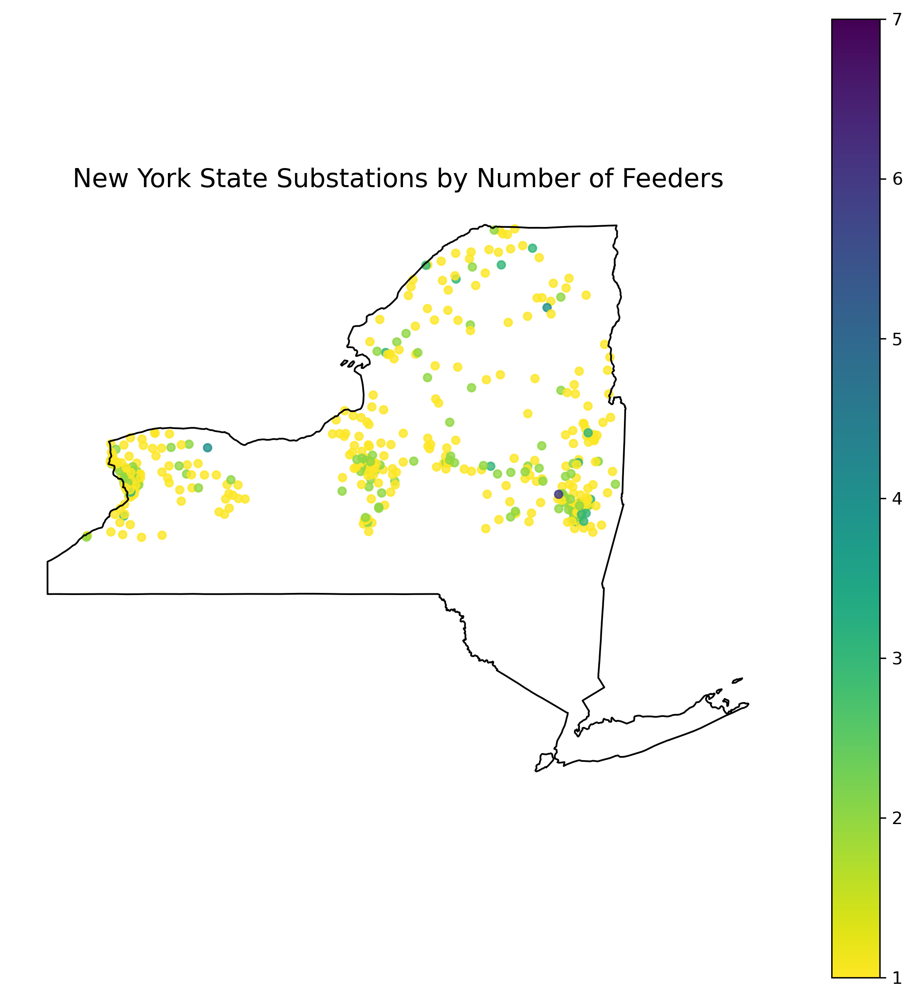

# New York State DPS Substations (2013)

This folder analyzes the 2013 list of substations published by the New York State Department of Public Service.

## Scripts

1. **`NYS_sub.py`**  
   - Converts `nys-substations.xlsx` into `nys_feeders.csv`

2. **`merged coord + feeders.py`**  
   - Merges National Grid data with NYSDPS list  
   - Saves merged data as `sub_shape.csv`

3. **`sub_shape.py`**  
   - Converts merged data into a geographic layer  
   - Outputs: `sub_shape.gpkg`

## Visualization

A map of New York State substations color-coded by the number of feeders.

